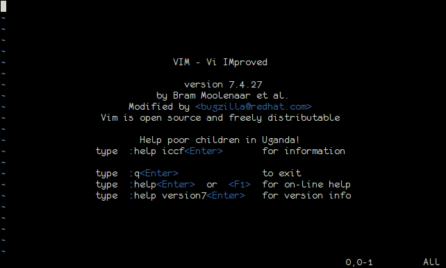

+++
title = "Introdução"

date = 2015-12-22
+++

Esta é a parte em que eu explico porque eu escrevi tudo isso e cujo conteúdo
não vai afetar em nada seu conhecimento de VIM ou a sua vida.

<!-- more -->

Em 2000 tive meu primeiro contato com programação em Linux e, como era de se
esperar, o primeiro editor sugerido foi o "VIM".

Foi WTF à primeira vista (e o clássico "Como é que eu fecho isso?").

Depois de usar outros editores por algum tempo (*cough* FTE *cough*), finalmente
decidi dar o braço a torcer e passei a usar VIM, continuo usando até hoje. Não
que eu tenha usado somente VIM desde então, utilizei outros editores (TextMate,
Sublime Text 2, Gedit) mas eu sempre sinto falta de alguma coisa nos outros
editores que acabei de acostumando no VIM. E, ainda, VIM ainda é o editor que
eu mais ouço "Cara, como é que tu fez isso?".

Não que VIM seja um editor completo e perfeito. Existem coisas novas surgindo a
todo momento que ninguém sequer imaginava quando VIM foi criado; existem coisas
que pelas próprias limitações do editor, o VIM não faz. Para algumas dessas,
existem plugins -- e eu vou falar de alguns interessantes mais pra frente -- e,
infelizmente, para outras, não há nada que possa ser feito, a não ser saber que
estas "faltas" existem e estar preparados para elas.

E vejamos quantos "Cara, como é que tu fez isso?" vão aparecer até o final
deste livro.

{{ chapters(next_chapter_link="../01-modos", next_chapter_title="Modos") }}
