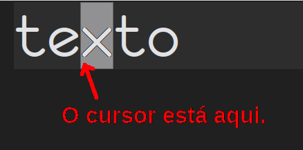
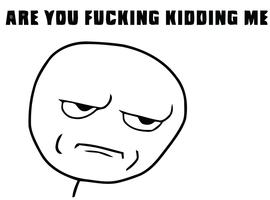

+++
title = "01.02. Entendendo o Cursor"
date = 2015-12-22
weight = 258
+++

Esta é a parte em que você vai lembrar quando o texto não parar exatamente
onde você pensava que ele iria parar.

<!-- more -->

Antes de passar para comandos do modo normal que realmente alteram o texto, é
preciso entender como o VIM entende o cursor, porque o funcionamento pode
parecer um pouco diferente dos demais editores.

Para todos os efeitos, considere que o cursor está sempre na parte inferior
esquerda do bloco do cursor.

Porque é importante ter isso em mente?

Porque a maior parte dos editores trata as coisas um pouco diferentes: Por
exemplo, se houver uma linha inteira no clipboard, o VIM irá inserir (com o
comando padrão de colar, que vamos ver mais adiante) a nova linha abaixo na
linha atual -- a maior parte dos outros editores cola a nova linha no lugar da
linha atual e move a antiga linha uma posição abaixo.

Apenas tenha isso em mente agora que vamos começar a mudar de modo e alguns
comandos consideram a posição do cursor desta forma e tem uma "contraparte"
para ações antes do cursor -- e por isso o próximo capítulo parece ter comandos
repetidos.


Todas as imagens são copyright (C) seus respectivos donos.


{{ chapters(prev_chapter_link="./01-01-modo-normal", prev_chapter_title="Modo Normal", next_chapter_link="./01-03-modo-de-insercao", next_chapter_title="Modo de Inserção") }}
