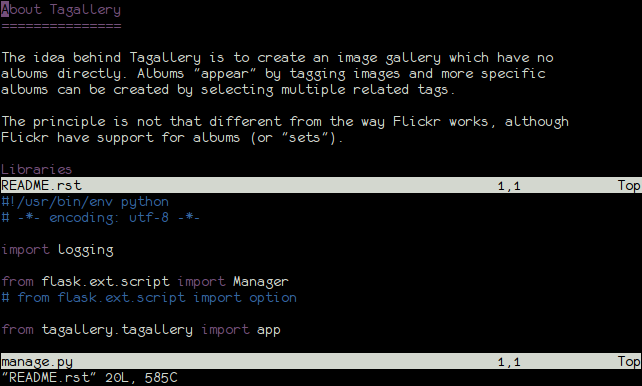
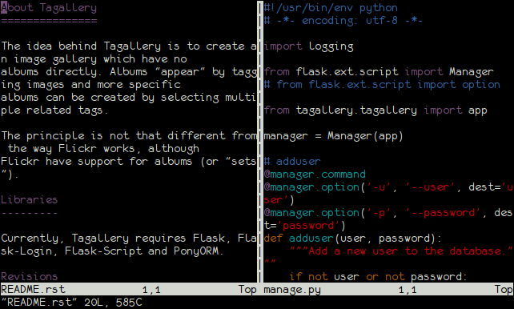
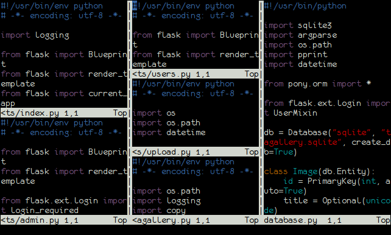

+++
title = "Splits"
date = 2015-12-22
+++

Essa é a parte em que você vai passar uma hora dividindo a tela em pedacinhos
cada vez mais pequenos.

<!-- more -->

Até agora, enquanto falávamos de editar textos no VIM, vimos apenas como editar
um arquivo por vez. Existem formas de editar mais de um arquivo (usando `:e` e
`:e#{número}`) mas estas estão longe de serem fáceis de serem utilizadas.

Existem duas formas de manter dois (ou mais) arquivos abertos ao mesmo tempo.
Uma delas são "splits". Basicamente, splits permitem que você "reparta" a tela
em pedaços, podendo mostrar outros arquivos (ou até mesmo outra vez o mesmo
arquivo).

Para criar splits, existem dois comandos que devem ser usados em modo de
comando: `:sp` e `:vsp`. Ambos comandos aceitam o nome do arquivo a ser aberto no
novo split; se não for passado o nome de um arquivo, o arquivo que já está
aberto será carregado.

A diferença entre eles é que `:sp` irá criar um split horizontal...

... enquanto que `:vsp` irá criar um split vertical.

Dentro de cada split, comandos executados irão afetar apenas o buffer atual: `:w`
irá salvar apenas o arquivo apresentar no split atual, `:e` irá abrir um arquivo
no split atual e assim por diante.

Note que eu falei "buffer atual". Como falei antes, "buffer" é o nome dado para
a representação do arquivo em memória e que tanto `:sp` quanto `:vsp` sem
parâmetros irão abrir um split com o arquivo atual -- que, na verdade, é o
buffer atual. Se você fizer isso e começar a editar o texto em um dos splits, o
conteúdo do outro também irá mudar, já que ambos estão apresentando o mesmo
buffer.

Para fechar um split, basta fechar o arquivo, tanto com `:q` quanto `:wq` ou
qualquer outro comando que feche um arquivo. O split será removido e o cursor
irá para o próximo split. Se não houverem mais splits, o VIM irá fechar, como
já vinhamos vendo desde o começo.

E sim, você pode fazer quantos splits e de formas diversas quantas vezes quiser
(até que não sobre mais espaço na tela, quer dizer).

Para "manusear" splits, você irá utilizar comandos que começam com, em modo
normal, `[Ctrl]w`. `[Ctrl]w`, por si só, não faz nada (a não ser que você
repita o comando, mas isso é outra coisa) e requer uma ação a ser executada no
split (assim como alguns comandos requerem uma movimentação).

## [Ctrl]wj ou [Ctrl]w[direcional para baixo]

Move o cursor para o split abaixo do atual. Se não houverem outros splits
abaixo do atual, permanece no mesmo. Aceita um número de repetiçoes, ou seja,
`3[Ctrl]wj` irá imediatamente pular para o 3o. split abaixo do atual.

## [Ctrl]wh ou [Ctrl]w[direcional para a esquerda] e [Ctrl]wk ou [Ctrl]w[direcional para cima] e [Ctrl]wl ou [Ctrl]w[direcional para a direita]

O mesmo que [Ctrl]wj, mas indo para o split da esquerda, acima ou direita,
respectivamente.

## [Ctrl]w+ e [Cltr]w-

Aumenta ou diminui o tamanho do split em uma linha. Se for passado um número
antes do comando -- por exemplo `3[Ctrl]w+` -- o número de linhas afetas será o
número indicado.

## [Ctrl]w> e [Ctrl]w<

O mesmo que `[Ctrl]w+` e `[Ctrl]w-`, mas altera o número de colunas ao invés do número de linhas.

## [Ctrl]w\_ e [Ctrl]w|

Deixa o split com o maior altura possível (ou seja, coloca o máximo de linhas
possíveis para o split) ou com a maior largura possível (ou seja, coloca o
máximo de colunas possíveis para o split).

## [Ctrl]w=

Altera o tamanho dos splits para que estes fiquem o mais equilibrados
possíveis.

## [Ctrl]wH, [Ctrl]wJ, [Ctrl]wK,/tt> e [Ctrl]wL

Move o split atual para o canto mais a esquerda, abaixo, acima ou direita,
respectivamente (note que a letra de movimentação está em maiúsculas).

## [Ctrl]ww

Move o cursor para o split anterior. Se você está em um split qualquer e fizer
`3[Ctrl]wj` para ir para o 3o split abaixo do atual, `[Ctrl]ww` irá
mover o cursor de volta para o split original (e `[Ctrl]ww` irá mover o cursor
de volta para o 3o split abaixo do atual).

## [Ctrl]wf

Abre o arquivo com o nome sob o cursor em um novo split.

Quando falei do grep, eu comentei que existe o comando `:cope` para abrir a
janela do Quickfix. Bom, se você quiser ficar pulando entre a janela do
Quickfix e o texto, os comandos `[Ctrl]w` acima irão ajudar.

Existem ainda alguns outros comandos para splits, mas veremos estes mais a
frente.

{{ chapters(prev_chapter_link="./08-localizar-substituir", prev_chapter_title="Localizar e Substituir", next_chapter_link="./10-abas", next_chapter_title="Abas") }}
