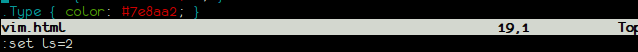
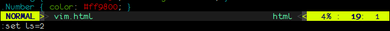
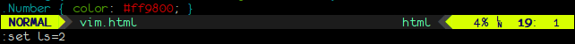
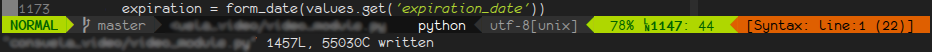

+++
title = "14.02. Plugins - Airline"
date = 2015-12-22
weight = 3586
+++

Essa é a parte em que o "laststatus" fica interessante.

<!-- more -->

Quando estávamos falando de configurações, falamos de uma configuração chamada
“laststatus”. Esta configuração tem 3 valores possíveis:

* 0 – não apresenta a barra de status, nunca.
* 1 – apresenta a barra de status se houver pelo menos um split.
* 2 – sempre apresenta a barra de status.

E, conforme eu mostrei no meu arquivo de configuração, eu sempre deixo com 2".

Acontece que a barra de status não é tããão informativa assim.



Ela tem o básico, mas o básico não é o suficiente, sejamos honestos. É possível
adicionar mais informações setando "statusline" (que eu não vou entrar em
detalhes aqui, mas para configurar, você tem que usar letras únicas indicado
para cada coisa que deseja apresentar tal como se faz com "guioptions") mas,
mesmo assim, certas coisas tem que vir de scripts externos (por exemplo, para
mostrar o branch atual que você está) e, como eu falei, essa parte é meio
chata.

Para aliviar essa confusão, existe um plugin chamado "Vim-Airline", que tem uma
apresentação mais complexa e oferece mais informações, baseados plugins que
você tem instalado.

Ainda, o Airline é uma versão mais leve do Powerline, que na verdade passou de
ser um simples plugin para VIM para ser um plugin para praticamente tudo (hoje
eu uso o Powerline para configurar meu prompt do terminal, por exemplo) e
algumas coisas ainda são usadas do Powerline (por exemplo, as fontes, mas
esperem aí que eu já explico o porque o Airline usa fontes especiais.)

(Conforme formos passando a lista de plugins que eu tenho, vocês vão ver o
Airline mudando de formato com o tempo.)

Como falei do Vundle como gerenciador de plugins, vamos usar o mesmo para
instalar (e manter, no futuro) o Airline.

No seu vimrc, adicione o seguinte:

```viml
Plugin "bling/vim-airline"
```

E, revisando: `:Plugin` adiciona um plugin na lista de plugins gerenciados pelo
Vundle (e apenas isso, nada mais); por ter uma barra no meio, estamos falando
de um repositório do Github; para instalar o plugin, você precisa ou adicionar
o plugin na lista manualmente (com o comando `:Plugin`) ou reiniciar o VIM caso
você queria conferir se a configuração no seu vimrc está certa e fazer
`:PluginInstall.`

Se nada apareceu, é porque o seu "laststatus" não está em "2".

Se tudo deu certo, você verá o seguinte:



Não que tenha melhorado muito, mas agora você tem informações sobre qual o modo
que você está atualmente (que vai mudar de cor conforme você passa para o modo
de inserção ou visual), o nome do arquivo, o tipo de arquivo (que define qual a
sintaxe está sendo usada), posição do cursor em relação ao todo do arquivo (em
percentual) e a posição absoluta do mesmo (em linhas em colunas).

Ok, duas coisas: Ainda não é muito melhor (embora a parte de mostrar o modo
ajude, acredite), mas temos alguns caracteres estranhos na barra.

É aí que entra a história do Powerline de novo: Os criadores do Powerline
usaram "posições" não usadas nas fontes unicode para adicionar outros
caracteres que são usados para melhorar a apresentação do status. Eles mantém
[um repositório com fontes já com os caracteres especiais](https://github.com/powerline/fonts)
e, caso a fonte que você queria não esteja na lista deles, [eles tem um script
para "patchear" a fonte desejada](https://github.com/powerline/powerline/tree/develop/font).

Uma vez que você tenha a fonte disponível no seu sistema, você deve adicionar no seu vimrc

```viml
let g:airline_powerline_fonts = 1
```

E o seu Airline, na próxima execução, deve ficar



Que é mais bonito, mas ainda continua mostrando as mesmas informações. Mais pra
frente veremos ã integração com “Fugitive” (um plugin para VIM para Git) e o
Syntastic (para validar o código com ferramentas externas) e como ambos são
suportados pelo Airline, você terá todas as informações ao alcance do rodapé da
janela.



Uma última nota: O Airline vem com suporte a temas, que você pode trocar usando
`:AirlineTheme` (e um duplo [Tab] depois disso irá mostrar os temas instalados).
Depois que escolher um, você pode definir

```
let g:airline_theme = '{nome do tema}'
```

no seu vimrc.

{{ chapters(prev_chapter_link="./14-01-vundle", prev_chapter_title="Plugins - Vundle", next_chapter_link="./14-03-fugitive", next_chapter_title="Plugins - Fugitive") }}
