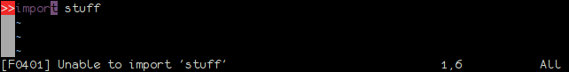
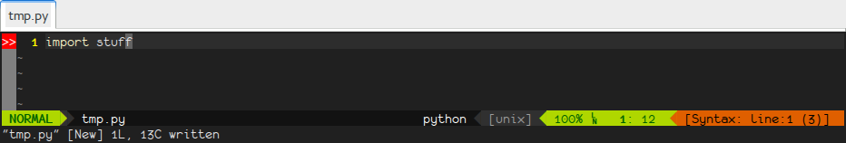

+++
title = "14.07. Plugins - Syntastic"
date = 2015-12-22
weight = 3591
+++

Essa é a parte que o VIM ajuda você a achar o que tem de errado no seu
código.

<!-- more -->

O sétimo plugin discutido é o [Syntastic](https://github.com/scrooloose/syntastic).
Para instalar com Vundle:

```viml
Plugin "scrooloose/syntastic"
```

Inicialmente, Syntastic não faz nada. O que ele faz é, depois de salvar o
arquivo em disco, chama a função de lint para o tipo de arquivo atual e mostra
os problemas encontrados no canto esquerdo do código; ao passar pela linha com
problema, o erro encontrado é reportado na linha de comando.



Para ver quais são todos os erros encontrados pelo aplicativo de lint, use
`:Errors`, que irá abrir uma janela de quickfix com a lista de erros encontrados.
Ações de janelas e de quickfix, que já vinhamos vendo, continuam valendo. É só
o comando para abrir o quickfix que é diferente neste caso.

Você pode selecionar quais lints serão usados adicionado com `let
g:syntastic_{linguagem}_checkers=['']` (por exemplo, para verificar arquivos Python apenas
com PyLint, você deve usar `let g:syntastic_python_checkers=['pylint']` mas nunca
tive problemas com os lints atuais).

Uma coisa que deve ser cuidada é que o lint deve estar disponível no momento
que o VIM abriu o arquivo, senão ele não será usado. Por exemplo, se você tiver
pylint disponível apenas dentro de um virtualenv, chamar o VIM antes de estar
no virtualenv fará com que Syntastic não encontre o pylint e, com isso, nenhum
erro será reportado.

Ainda, assim como aconteceu com Commentary, Syntastic usa o tipo de arquivo
atual, não o do bloco. Por exemplo, ao editar um arquivo de template de Django,
que tem partes na linguagem de template do Django, HTML, CSS e JavaScript,
mesmo que você tenha os lints para HTML, CSS e JavaScript instalados, estes não
serão executados -- porque o VIM considera o arquivo um tipo inteiro, não um
conjunto de pequenos blocos de tipos diferentes.

E, por último, Airline tem suporte para mostrar os erros encontrados pelo
Syntastic na barra de status. Se você adicionar

```viml
let g:airline_enable_syntastic = 1
```

... no seu vimrc, o canto direito da barra de status irá mostrar a primeira
linha com erro e a quantidade de erros encontrados.



{{ chapters(prev_chapter_link="./14-06-autopairs", prev_chapter_title="Plugins - Auto-Pairs", next_chapter_link="./14-08-snipmate", next_chapter_title="Plugins - SnipMate") }}
