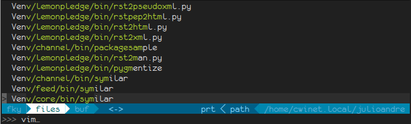

+++
title = "Plugins - CtrlP and CtrlPFunky"
date = 2015-12-22
+++

Essa é a parte em que você vai ter a impressão de estar programando em Perl,
porque qualquer caractere é válido.

<!-- more -->

O nono e penúltimo plugin (na verdade os nonos e penúltimos plugins) discutido
é o [CtrlP](https://github.com/kien/ctrlp.vim) e seu plugin (sim, um plugin do
plugin[^1]) [CtrlPFunky](https://github.com/tacahiroy/ctrlp-funky)

Para instalar os dois, com Vundle:

```viml
Plugin "kien/ctrlp.vim"
Plugin "tacahiroy/ctrlp-funky"
```

CtrlP é um plugin que facilita encontrar e abrir arquivos, com procura fuzzy.
E, por procura fuzzy eu quero dizer que ele encontra qualquer arquivo que tenha
as letras digitadas na ordem que você digitou.



Para acionar o CtrlP, você deve digitar, logicamente, `[Ctrl]p`. Ao fazer isso,
uma janela parecida com a Quickfix irá aparecer, mostrando alguns arquivos e um
prompt para que você digite o que quer encontrar. No exemplo acima, como que
digitei "vim", ele encontrou todos os arquivos a partir do diretório atual que
começavam com "v", tinham um "i" no meio e terminavam com "m" (seria
basicamente o mesmo que pegar a lista de arquivos a partir do diretório atual e
seus sub-diretórios e procurar pela regex "v.\*i.\*m".)

Uma vez que você encontre o arquivo desejado na lista (ela não tem rolagem,
então se você ainda não estiver vendo o arquivo, continue adicionando
caracteres para que o arquivo desejado apareça na lista -- uma vez lá, você pode
selecioná-lo com as setas), você pode:

* Pressionar `[Enter]` para abrir o arquivo na janela atual.
* Pressionar `[Ctrl]t` para abrir o arquivo em outra aba.
* Pressionar `[Ctrl]s` para fazer um split horizontal e abrir o arquivo no novo
  split.
* Pressionar `[Ctrl]v` para fazer um split vertical e abrir o arquivo no novo
  split.

Um problema que você talvez encontre é que o CtrlP costuma listar tudo que se
encaixar na expressão utilizada, inclusive arquivos binário, objetos
intermediários, etc. Para remover estes arquivos da listagem, você pode usar
`:set wildignore`, que também afeta a lista de arquivos que o VIM mostra quando
você estiver usando os comandos normais de abertura de arquivo (`:e`, `:tabe`,
etc).

Como a configuração do wildignore é uma lista, você pode adicionar ou remover
usando += e -=. Por exemplo, para ignorar os arquivos de objetos compilados do
Python e o diretório que o setup.py constuma usar para construir o pacote de
distribuição do módulo, você teria:

```viml
set wildignore+=*.pyc
set wildignore+=*/build/*
```

ou ainda, para economizar uma linha:

```viml
set wildignore+=*.pyc,*/build/*
```

CtrlP tem um plugin, chamado CtrlPFunky. O que ele faz é basicamente o mesmo
que o CtrlP, mas procurando funções, não arquivos.

Para ativar o CtrlPFunky, você precisa primeiro adicionar o mesmo como uma
extensão do CtrlP (e, só pra avisar, isso é específico do CtrlP, não algo que
funciona com todo e qualquer plugin):

```viml
let g:ctrlp_extensions = ['funky'] 
```

Uma vez instalado, você pode usar `:CtrlPFunky` para mostrar a lista de funções
no fonte (e a procura continua igual). O problema com CtrlPFunky é que, assim
como todas as demais coisas que vínhamos vendo, ele se basea no tipo de arquivo
atual (`:set ft`) e para arquivos em que o conteúdo e uma mistura de várias
linguagens (p.ex., arquivo template com a linguagem de template, HTML, CSS e
JavaScript), a listagem de funções pode não ser o que você está esperando (ou
sequer vai funcionar).

Para facilitar a sua vida, você pode fazer um mapeamento do comando para um
atalho de teclado. Por exemplo, eu coloquei `[Ctrl]o` para chamar o CtrlPFunky
com

```viml
nnoremap <C-O> :CtrlPFunky<CR>
```

[^1] "Plugin-ception" har har har[^2].

[^2] Eu não consigo entender porque as pessoas utilizando tanto o "ception"
	 quando encontram um meta desta jeito. Um "inception" é a inserção de uma
	 idéia de forma que a pessoa pense que a idéia é dela, não uma
	 "[Matrioska](http://pt.wikipedia.org/wiki/Matrioska)".

{{ chapters(prev_chapter_link="./14-08-snipmate", prev_chapter_title="Plugins - SnipMate", next_chapter_link="./14-10-multiple-cursors", next_chapter_title="Plugins - Vim-Multiple-Cursors") }}
