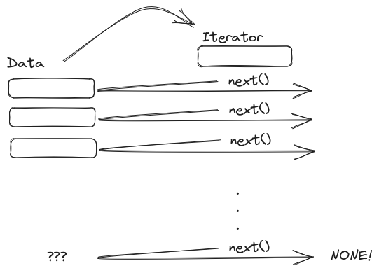
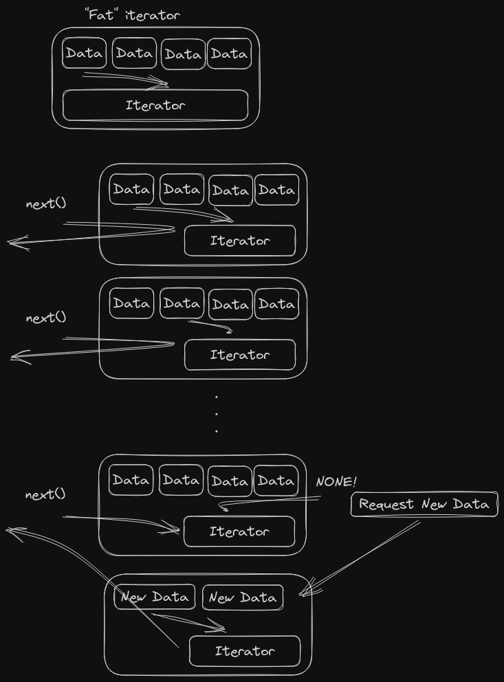

+++
title = "Overthinking Rust Iterators"
date = 2023-07-06

[taxonomies]
tags = ["rust", "iterators", "request", "stream"]
+++

I had some issue recently with Rust iterators, and that led me to think *a lot*
about iterators in Rust.

<!-- more -->

What I wanted to do was something not exactly direct in Rust:

- The issue was an external REST API;
- The API returns the data in chunks, providing a paging mechanism;
- The API indicates that there are more data with a `next` field, which either
  has the URL for the next page or an empty string if you're in the last page
  and there is no more data;
- On my side, I wanted something akin to (which is basically an iterator,
  anyway)

```rust
let service = Service(connection_information);
let data = service.data();  // This provides the iterator
while let Some(record) = data.next() {
    do_something(&record);
}
```

- The `.data()` iterator would get the first page and start iterating over
  those results;
- Once the results were all consumed, if the API informed that there is more
  data, the iterator (or *something*) would request more information, adjust
  itself for the new data and just keep chugging till all the data was
  produced.

Notice that the iterator I want have two sides: One is to spew information from
previous request from memory/cache; the second is requesting (or triggering the
request somewhere) for more data.

# Back to Iterators

Basic iterators work like this:



... which you have a dataset, create an iterator over them and each call of
`.next()` on it will advance the iterator over the next element of the data and
return a reference to that data; once it reaches the end of data, it returns a
`None`, indicating that there are no more data.

The fun thing about iterators is that they need to hold their own state: Which
is the current element that I'm pointing to? The `.next()` receives a mutable
reference of self exactly due this: It changes its state on each call of
`.next()`.

What I need is, basically, an iterator that does that **and**, once it sees
`None`, retrieves more data and starts over. This raises the question: How does
the iterator gets more data?

# The Fat Iterator Approach

The idea I had was to create a fat iterator that would "hold" its own data and
iterate over it.



Because the data is simply a `Vec<>`, I could do something like:

1. Pull data from service;
2. Update the `data` inside the iterator;
3. Create a new iterator over said `data`;
4. Call `.next()` on the iterator till it turns into `None`;
5. If there is more data, do the request and jump to 2.

If we jump back to the fact that `.next()` updates the iterator internal state,
this means that I'd need to keep the data **and** its iterator in the same
structure. And that causes issues with the borrow checker, 'cause I can't own
part of the data when I own the whole data (yes, it feels like a problem with
the borrow check, but still).

The idea seems solid, except I'd be fighting the borrow checker to a point I'm
not capable yet.

# The "Request Someone Else" Iterator

The other idea I had (but couldn't figure out how it would work) was to,
instead of `service.data()` return an iterator, it would return the data holder
and *that* could create an iterator over itself. The weird thing about this is
that the iterator would have to have a mutable reference to the source data, so
it could call the parent when it reached the end of the data, and the parent
would get a new data source and the iterator would "reset itself" after calling
it -- which sounds more complex than it should.

(I could also make the parent holder have a `Cell<>` over data to have just
internal mutability over it, but again, sounds more complex than it should).

# The Solution

Sorry, no solution (yet). I'm still tinkering with it and I'll update this
once I find something that works and it doesn't require two (or more) things
(mutably) interacting between themselves.
