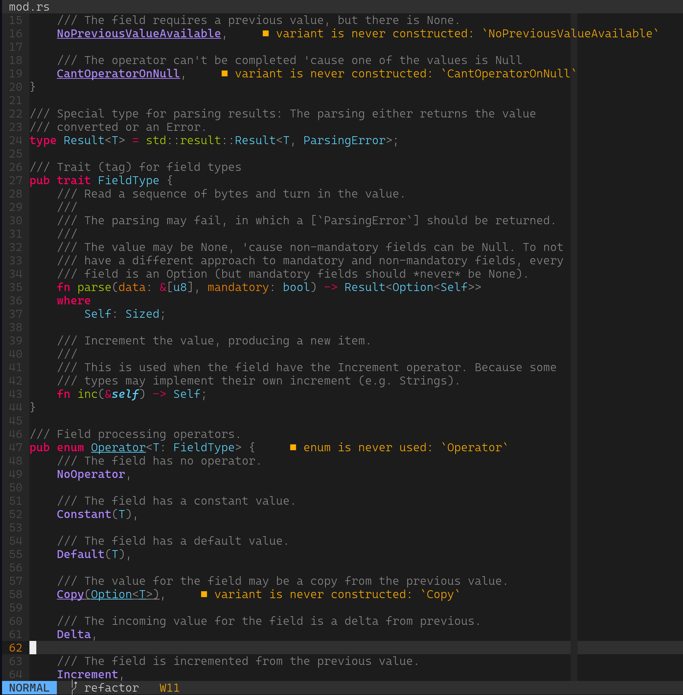

+++
title = "I Redid My NeoVim Configuration"
date = 2022-01-19

[taxonomies]
tags = ["vim", "neovim", "nvim", "config", "lsp", "treesitter"]
+++

For some obscure reason, my NeoVim install decided it didn't want to
display LSP warnings anymore. So I redid the whole configuration.

<!-- more -->

Believe me, I didn't do 'cause "OMG, so broken". I guess I could have tracked
the problem to the way
[LanguageClient](https://github.com/autozimu/LanguageClient-neovim) was
installed -- it could be even out-of-date, 'cause I updated to NeoVim 0.6
recently -- but I also wanted to install the TreeSitter support, for better
highlight. Those two factors were enough to me to try a different
configuration, so I decided to do the full thing and rewrite the whole
configuration file, using the Lua format.

I started with the [post of Takuya
Matsuyama](https://blog.inkdrop.app/how-to-set-up-neovim-0-5-modern-plugins-lsp-treesitter-etc-542c3d9c9887),
just as reference -- I'm not a user of a package manager (and
there may lie the problem with some outdated plugin) and I really prefer to
work with submodules and whatnot -- a way that is pretty close to what
[Pathogen](https://github.com/tpope/vim-pathogen) does.

As I wanted to move some things from my old configuration to the new, I had to
search on how to "translate" those. That's where I found [a post by Heiker
Curiel](https://vonheikemen.github.io/devlog/tools/configuring-neovim-using-lua/),
which lists old configuration options and how they appear in the Lua config.

The result is that I have a brand sparkling NeoVim install, with all the bells
and wristles:

The whole configuration file is [in my personal Git
repo](https://git.juliobiason.me/dotfiles.git/tree/nvim).
