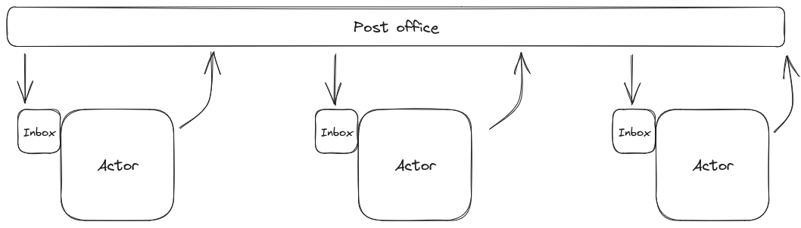

+++
title = "Thinking About Rust Actors"
date = 2023-08-11

[taxonomies]
tags = ["rust", "actor model"]
+++

I recently wrote an application for work (so, sorry, can't show you the code)
that, 'cause it was heavily I/O based, I decided to write it using
[Tokio](https://tokio.rs/) and the idea of [Actor Model with
it](https://ryhl.io/blog/actors-with-tokio/).

... which gave me some things to think about.

<!-- more -->

Before anything, actors in Rust are very different from the actors in languages
with the actual Actor Model. In summary, you have your actors, which running
independently, each actor have an Inbox for things to be processed and an
"outbox" -- in quotes, 'cause that's not really it. An actor can receive a
message, process it and then it can just be done with it or it can produce
something that it is send to another actor -- that's its outbox, which usually
differs from the Inbox 'cause the Inbox need to have a queue of sorts, but the
Outbox doesn't (and that's why I've been using "outbox" with quotes before).

All the messages are delivered by a "post office" of sorts, that connects all
Actors:



On my implementation, the actor is actually a module with a `run()` function;
this function exposes the `Sender` part of a MPSC
(Multiple-Producer-Single-Consumer) channel which acts as the Inbox of it and
the task PID, so the can `.await` the actor processing loop to avoid the main
application from finishing with the actor still running. 


For now, I'm ignoring Tokio and async for next examples.


And because there is no "Post Office" kind of solver in Rust, I short-circuited
the actors by giving the `Sender` channel of an actor as parameter to a second,
so it knows where to send its messages. Something like:

```rust
let channel3 = actor3::run(...);
let channel2 = actor2::run(channel3);
actor1::run(channel2);
```

In this short sample, whatever "actor1" produces, it sends directly to "actor2"
though the channel the latter created; "actor2", on its part, produces
something that is received by "actor3". And, with more actors, things just keep
chaining.


I am intentionally ignoring the internals of each actor and their `run()`
function, but they are some variations of:

```rust
fn run(..) -> (task::JoinHandle<()>, mpsc::Sender<TheKindOfMessageTheActorAccepts>) {
    let (tx, mut rx) = mpsc::channel::<TheKindOfMessageTheActorAccepts>(SOME_SIZE);
    let task = tokio::spawn(async move {
        while let Some(incoming) = rx.recv().await {
            let conversion = actor_process(incoming);
            // maybe send the conversion to the next actor?
        }
    });
    (task, tx)
}
```


But... 'cause the actors have (very similar) interfaces, that looks like a
trait!

So, what should be the Actor trait?

First thing, its `run()` or similar function should expose its PID and its
receiving channel. Something like:

```rust
pub trait Actor {
    fn run() -> (task::JoinHandle<()>, Sender<TheKindOfMessageTheActorAccepts>);
}
```

Why `TheKindOfMessageTheActorAccepts`? That's because each actor may have a
different input message. If we take our short sample above, "actor2" may be
receiving `usize`s and sending them as `String`s to "actor3".

Because that type may change from actor to actor, it should be an associated
type:

```rust
pub trait Actor {
    type Input;

    fn run() -> (task::JoinHandle<()>, Sender<Self::Input>);
}
```

So the basic idea is that, once the trait is implemented in a struct, we could
managed it like:

```rust
let actor3 = Actor3::new(..);
let (actor3_pid, actor3_channel) = actor3::run();
```

Wait, what about the chaining? We could do something simple like:

```rust
let actor3 = Actor3::new(..);
let (actor3_pid, actor3_channel) = actor3::run();
let actor2 = Actor2::new(actor3_channel);
let (actor2_pid, actor2_channel) = actor2::run();
```

... which is kinda verbose, but does work.

I have some ideas to make this part more fluent, but I need to do some more
exploration about the topic (specially since I think we can leverage the type
system to not allow connecting actors whose input type is not the same as the
output type of the previous actor). Once I get those hammered down, I'll get a
follow up post.

<!-- 
vim:spell:
-->
