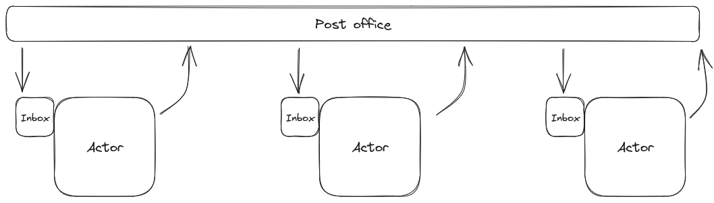

+++
title = "Pensamentos Sobre Atores em Rust"
date = 2023-08-17

[taxonomies]
tags = ["rust", "actor model"]
+++

Recentemente eu escrevi uma aplicação para o trabalho (desculpa, não posso
mostrar o código) que, por ser fortemente baseada em I/O, eu decidi escrever
usando [Tokio](https://tokio.rs/) e a ideia de usar [Actor Model com
isso](https://ryhl.io/blog/actors-with-tokio/).

... o que me levou a pensar um pouco mais sobre isso.

<!-- more -->

Antes de mais nada, Actors em Rust são bem diferentes de atores em linguagens
com um Actor Model de verdade. Em resumo, você tem os seus atores, que rodam de
forma independente, cada ator tem uma caixa de entrada (inbox) para coisas a
serem processadas e uma "caixa de saída" -- com aspas, porque não é exatamente
isso. Um ator recebe uma mensagem, processa mesma e pode ter terminado aí ou
pode produzir algo para ser processado por outro ator -- que seria a caixa de
saída, o que normalmente difere da caixa de entrada porque a caixa de entrada
tem uma fila, mas a caixa de saída não (e é por isso que eu estava usando
"caixa de saída" com aspas antes).

Todas as mensagens são entregues por um "correio" (ou "post office" no inglês),
que conecta todos os atores:



Na minha implementação, o ator era um módulo com uma função chamada `run()`;
essa função expõe a parte de `Sender` de um canal MPSC
(Multiple-Producer-Single-Consumer, ou "Vários Produtos, Um Consumidor") que
haje como a caixa de entrada do ator, e o PID da tarefa, de forma que é
possível fazer um `.await` no loop de processamento para evitar que a aplicação
principal termine enquanto o ator ainda está ativo.


Nos exemplos abaixo, eu vou completamente ignorar a parte do Tokio e async.


Como não há alguma coisa que funcione como um "Correio" em Rust, eu fiz uma
ligação direta entre os atores, entregando o canal `Sender` de um ator como
parâmetro para o segundo, de forma que o segundo saiba para onde enviar as suas
mensagens. Algo do tipo:

```rust
let canal3 = ator3::run(...);
let canal2 = ator2::run(canal3);
ator1::run(canal2);
```

Nesse exemplo, seja lá o que `ator1` produza, ele envia diretamente para o
"ator2" através do canal que o segundo criou; "ator2", por sua vez, produz
alguma coisa que é recebida pelo "ator3". E, com mais atores, só é preciso
ficar fazendo as conexões.


Eu estou intencionalmente ignorando os internos de cada ator e as suas funções
`run()`, mas elas seriam variações de:

```rust
fn run(..) -> (task::JoinHandle<()>, mpsc::Sender<TipoDeDadosQueOAtorRecebe>) {
    let (tx, mut rx) = mpsc::channel::<TipoDeDadosQueOAtorRecebe>(UM_TAMANHO);
    let task = tokio::spawn(async move {
        while let Some(dado) = rx.recv().await {
            let conversao = processamento_do_ator(dado);
            // Talvez envie o "conversao" para o próximo ator?
        }
    });
    (task, tx)
}
```


Mas... como os atores parecem ter uma interface muito parecida, isso se parece
com uma trait!

Então, como deveria ser a trait de Atores?

Inicialmente, a função `run()` ou similar devem expor o PID do ator e o canal
de entrada. Algo como:

```rust
pub trait Actor {
    fn run() -> (task::JoinHandle<()>, Sender<TipoDeDadosQueOAtorRecebe>);
}
```

Por que `TipoDeDadosQueOAtorRecebe`? É por que cada ator pode ter um tipo de
mensagem diferente de entrada. Usando o pequeno exemplo acima, "ator2" poderia
estar recebendo `usize` e enviando `String`s para o "ator3".

Como o tipo muda de ator para ator, nós precisamos de um tipo associado:

```rust
pub trait Actor {
    type Input;

    fn run() -> (task::JoinHandle<()>, Sender<Self::Input>);
}
```

A ideia básica é que, uma vez que a trait seja implementada por uma struct,
nós possamos fazer algo como:

```rust
let ator3 = Ator3::new(...);
let (ator3_pid, canal_ator3) = ator3::run();
```

Mas peraí, e como faríamos a ligação entre atores? Isso poderia ser feito com
algo simples como:

```rust
let ator3 = Ator3::new();
let (ator3_pid, ator3_canal) = ator3::run();
let ator2 = Ator2::new(ator3_canal);
let (ator2_pid, ator2_canal) = ator2::run();
```

O que fica meio verboso, mas funciona.

Eu tenho algumas ideias de como fazer a parte de ligação mais fluente, mas eu
preciso fazer algumas explorações no tópico (principalmente porque eu acho que
dá pra usar o sistema de tipos de Rust para não permitir que sejam conectados
atores cujo tipo de entrada é diferente do tipo de saída do anterior). Quando
eu conseguir pensar em algo, eu faço um post explicando.
<!-- 
vim:spelllang=pt:spell
-->
