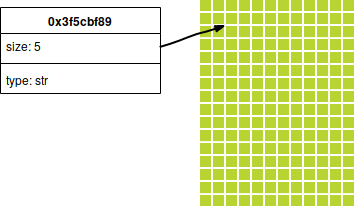

+++
title = "Porque Você Deve Aprender Rust"
date = 2019-09-10

[taxonomies]
tags = ["pt-br", "rust", "companion post"]
+++

Rust é uma nova linguagem de programação que eu acredito que deveria ser vista
por desenvolvedores, mesmo que eles não venham programar em Rust.

<!-- more -->


Esse post acompanha a minha apresentação [Porque Você Deve Aprender
Rust](https://presentations.juliobiason.net/porque-rust.html#/).


Quando eu comecei a apresentação, eu pensei em chamar a mesma de "Porque Você
Deveria Aprender Rust"; mas eu pensei bem sobre isso e como a linguagem tem
vários conceitos interessantes, eu acho que o título correto deve ser "Porque
Você DEVE Aprender Rust".

Mas antes de começar a falar sobre Rust, é interessante que vocês conheçam
quem está dizendo que vocês "devem aprender Rust":

Eu comecei a programar a mais de 30 anos. Em todos esses anos, eu já programei
em Basic (usando número de linhas e Basic estruturado, também conhecido como
QBasic), dBase III Plus, Clipper (que foi a primeira linguagem que eu usei
profissionalmente), Pascal, Cobol (sim, Cobol, façam suas brincadeiras agora),
Delphi (cujo nome científico é "ObjectPascal" e possui algumas diferenças para
o Pascal original), C, C++, ActionScript (que é a linguagem para geração de
applets Flash sem usar o editor da Adobe), PHP (quem nunca?), JavaScript (quem
nunca?), Python, Objective-C, Clojure, Java, Scala (que eu não desejo que nem
meu pior inimigo tenha que programar nela) e Rust. E essas são as linguagens
que eu já escrevi código e que rodou. Fora essas, eu ainda conheço Haskell,
Perl, um pouco de Ruby e Swift, mas nessas eu não programei nada ainda.

Mas por que eu comentei sobre isso? Porque o que eu vou comentar aqui é,
basicamente, _minha opinião_, depois de conhecer essas linguagens todas.
Então, obviamente, existe um _viés_ para os motivos que eu vou citar daqui pra
frente.

Mas existe uma frase do Alan Perlis, criador do ALGOL, que diz "A language
that doesn't affect the way you think about programming, is not worth knowing"
(uma linguagem que não afeta o modo que você pensa sobre programação, não vale
a pena ser aprendida). E mesmo depois de todas essas linguagens citadas acima,
Rust ainda me fez repensar coisas que eu sempre pensei quando estava
programando.

## A Parte Burocrática

Antes de sair falando da linguagem, eu tenho que falar sobre a parte
burocrática da linguagem. Coisas como, por exemplo:

* Rust foi criada em 2006 por Graydon Hoare.
* Rust começou a ser patrocinada em 2009 pela Mozilla Foundation.
* A versão 1.0 saiu em 2015.
* A versão atual é a 1.37.

Rust tem uma história engraçada: Hoare começou a desenvolver a linguagem de
forma independente, em seu tempo livre. Quando ele começou a pegar gosto pela
coisa, ele veio falar com seu gerente dizendo que iria deixar a Mozilla
Foundation para poder trabalhar na sua linguagem de programação. "Que
linguagem é essa?", perguntou o gerente; Hoare afirmou que era uma linguagem
com foco em proteção de memória mas que ainda fosse uma linguagem rápida. Ao
ouvir isso, o gerente pediu para Hoare segurar o pedido de demissão e
conversou com seus superiores. E, por ter vários problemas com a estrutura em
C++ do Firefox, a Mozilla resolveu patrocinar Hoare para que ele pudesse
trabalhar na linguagem.


Eu gosto de brincar, dizendo que o Hoare chegou pro gerente dele dizendo que
iria deixar a Mozilla pra trabalhar na sua linguagem e o gerente, depois de
pedir pra ele esperar um pouco, chegou dizendo que só conseguiu 2 estagiários.

A verdade é que Hoare realmente quis deixar a Mozilla Foundation, mas ao
explicar os motivos -- trabalhar na sua própria linguagem, cuja principal
diferença seria a proteção de memória e velocidade -- a Mozilla se interessou
pela mesma, por causa dos problemas que eles estavam encontrando ao trabalhar
com C++. Por isso a Mozilla continuou pagando Hoare para que ele trabalhasse
na sua linguagem.


Uma coisa a cuidar: Aqui eu comento que a versão atual é a 1.37. Isso pode não
ser verdade no momento que você lê esse post (ou viu a apresentação) porque a
cada 6 semanas uma nova versão do Rust é liberada. Essas versões trazem
correções de bugs e novas features.


Uma outra anedota é que o primeiro projeto em Rust foi um browser --
normalmente a gente pensa que para primeiro projeto, as linguagens querem algo
mais simples, como um microserviço ou algo parecido, mas a equipe do Rust
partiu direto para um browser.

O resultado, chamado [Servo](https://servo.org/), hoje faz parte do [Firefox
Quantum](https://www.mozilla.org/en-US/firefox/?gclsrc=aw.ds), o que diminui o
uso de memória e diminuiu o número de "crashes" da aplicação.

Ainda, num certo ponto, um desenvolvedor do Chrome resolveu fazer alguns
testes, utilizando SVG animados, colocando 1 elemento animado 300 vezes numa
página. Para animar todos os elementos, o Chrome conseguia manter 30 FPS;
Firefox, 20; Servo, 300 (sim, 10 vezes mais que o Chrome!).

Outro exemplo de Rust no Firefox é um bug que estava em aberto por 8 anos. O
bug em questão, [631527](https://bugzilla.mozilla.org/show_bug.cgi?id=631527)
-- que, na verdade, é uma feature -- seria permitir que dois elementos possam
ter os estilos definidos no CSS aplicados em mais de um elemento ao mesmo
tempo; o browser lê primeiro o HTML, constrói o DOM e depois sai aplicando o
estilo em cada um dos elementos; com dois elementos um depois do outro, seria,
teoricamente, possível aplicar o estilo no primeiro ao mesmo tempo em que
aplica no segundo. O bug ficou aberto por 8 anos e duas re-escritas foram
feitas pra tentar resolver o problema. Nenhuma conseguiu prover um resultado
funcional, por vários motivos, mas principalmente por causa da forma com a
memória era compartilhada nas threads em C++. Quando o Firefox mudou para o
Quantum (de novo, em Rust, usando a base do Servo), a correção foi (conforme
descrito por Niko Matsakis na abertura do Rust Latam 2019) "trivial".


## Motivo 1: Quem Usa, Gosta

Em 2019, O [StackOverflow](https://stackoverflow.com/) fez uma enquete com os
visitantes, perguntando, entre várias outras perguntas, qual linguagem eles
usavam e se eles gostavam de programar nessa linguagem. No resultado dessa
enquente, [Rust aparece como a linguagem mais
amada](https://insights.stackoverflow.com/survey/2019#technology-_-most-loved-dreaded-and-wanted-languages)...
pelo 4o ano seguido.

"Ah, mais isso é fácil! Os quatro caras que programam em Rust dizem que gostam
dela todo ano!", você deve estar dizendo. Na verdade, o percentual tem subido
desde a primeira vez, saindo de 76% em 2016 e indo a 83% em 2019.

## Motivo 2: "Uma Linguagem de Baixo Nível Com Abstrações de Alto Nível"

Quando comparado com C, Rust tem uma performance bem semelhante:


O gráfico acima foi tirado de uma pesquisa que foi feita para verificar [qual
linguagem gasta mais
energia](https://jaxenter.com/energy-efficient-programming-languages-137264.html). 

Na implementação utilizada, C foi a linguagem cujo código gerado usou menos
energia; em segundo, com uma utilização apenas 3% maior, Rust.

Ainda, em tempo de execução, a aplicação gerada em C também é a mais rápida e
Rust fica em segundo com um tempo de execução apenas 4% maior.

No quesito utilização de memória é que vemos algo engraçado: A linguagem que
melhor utiliza memória é Pascal, C utiliza 17% mais memória e Rust 54% a mais.
A explicação para isso pode ser pela forma como Rust trata memória,
principalmente de código, mas eu vou explicar isso melhor mais pra frente.

E, apesar disso tudo, Rust tem implementações de:

* Strings com tamanho crescente;
* Listas dinâmicas;
* Mapas.

E considerando todo o tempo que eu passei programando em várias linguagens, se
amanhã surgisse uma linguagem que conseguisse ter uma performance melhor que
C, mas que eu tivesse que implementar minha própria lista encadeada, eu
acredito que botaria fogo em tudo e iria plantar batatas, porque,
honestamente, significa que nós não aprendemos nada sobre linguagens de
programação.

## Motivo 3: Compilador É Chato, Mas Amigável

Deixem-me mostrar um código Rust:

```rust
fn main() {
    let a = 2;
    a = 3;
    println!("{}", a);
}
```

Aqui temos nosso primeiro contato com a sintaxe de Rust: `fn` define funções;
assim como C, `main` é a função que indica onde a execução começa; `let` deixa
definir variáveis e, apesar de não mostrar nesse trecho, as variáveis são
fortemente tipadas, mas eu não precisei colocar o tipo porque o compilador
consegue inferir o tipo sozinho (com algumas raras exceções); linhas terminam
com `;`; `println!` tem uma exclamação porque essa função é uma macro e a
exclamação é colocada para diferenciar de funções normais (no caso, o
`println!` vai ser expandido pelo compilador por um conjunto maior de
comandos).


Quem já brincou com `#define`s em C deve saber que não existe nada que indique
o que foi digitado é uma função mesmo ou um `#define` que vai ser expandido em
várias outras funções; Rust não deixa isso acontecer.


E esse código Rust não compila.

Se vocês tentarem compilar esse código, vocês verão a seguinte mensagem de
erro:

```
3 |     let a = 2;
  |         -
  |         |
  |         first assignment to `a`
  |         help: make this binding mutable: `mut a`
4 |     a = 3;
  |     ^^^^^ cannot assign twice to immutable variable
```

O que acontece é que, em Rust, alem das variáveis serem fortemente tipadas,
elas também são, por padrão, imutáveis. Ou seja, não é possível, por padrão,
alterar o valor de uma variável.

Mas prestem atenção na mensagem de erro:

```
4 |     a = 3;
  |     ^^^^^ cannot assign twice to immutable variable
```

O compilador não apenas disse qual era o erro -- "não é possível atribuir um
valor duas vezes para uma variável imutável" (indicando, ainda qual a linha)
como também passou uma dica de como corrigir esse problema:

```
  |         help: make this binding mutable: `mut a`
```


Essa parte da mensagem de erro é importante para o time de desenvolvimento do
Rust.

Na Rust Latam, Esteban Kuber fez uma apresentação chamada "Friendly Ferris:
Developing Kind Compiler Errors" ("Ferris Amigável: Desenvolvendo Erros
Amigáveis do Compilador", onde "Ferris" é o nome do mascote da linguagem),
onde ele conta que foi brincar com Rust pela primeira vez e recebeu um erro do
compilador sobre o código que ele tinha escrito, mas não conseguiu entender
exatamente qual era o problema.

Aqui fica a pergunta pra vocês: Se vocês encontrassem um erro que não
entendessem o que vocês fariam? Boa parte provavelmente diria que iria
perguntar ao Google.

Esteban, no entanto, resolveu abrir um issue no Github da linguagem, para ver
o que iria acontecer. A resposta? "Você tem razão, a mensagem do erro é
difícil de entender, e isso é um bug do compilador. Nós vamos arrumar."
Esteban se ofereceu pra tentar encontrar o problema, recebeu uma tutoria de
como compiladores funcionam e hoje é um dos expoentes nas questões de
mensagens de erro do compilador.


## Motivo 4: O Borrow Checker

O Borrow Checker é a funcionalidade que faz o Rust ser diferente de outras
linguagens. E que também mudou como eu pensava sobre programação, apesar de
todas as linguagens listadas no começo desse post.

Por exemplo, no seguinte código:

```rust
let a = String::from("hello");
```


O que está sendo feito aqui é que está sendo criada uma string -- uma lista de
caracteres que pode ser expandida, se necessário -- utilizando uma constante
que é fixa (por ficar em uma página de código em memória) como valor inicial.

Quem já mexeu com C: Isso é o mesmo que alocar uma região de memória e copiar
o conteúdo de uma variável estática para a nova região alocada.


Quando vocês olham esse código, o que vocês pensam?

Eu sempre li como "A variável `a` recebe o valor `hello`".

Eu nunca pensei nisso como "A posição de memória apontada por `a` tem o valor
`hello`"; ou algo como `let 0x3f5cbf89 = "hello"`.

Entretanto, é isso que o compilador do Rust faz: cada atribuição de variável é
considerada como um indicador de uma posição de memória, algo do tipo



No caso, `a` (a nossa variável) é "dona" de uma região de memória, a
0x3f5cbf89, que tem o tamanho de 5 bytes, do tipo String.

E aí você faz uma atribuição de variáveis como, por exemplo:

```rust
fn main() {
    let a = String::from("hello");
    let _b = a;
    println!("{}", a)
}
```

... tudo parece normal.

Exceto que esse código não compila.

```
error[E0382]: borrow of moved value: `a`
 --> src/main.rs:5:20
  |
4 |     let _b = a;
  |              - value moved here
5 |     println!("{}", a)
  |                    ^ value borrowed here after move
  |
  = note: move occurs because `a` has type
    `std::string::String`, which does not
    implement the `Copy` trait
```

Por que? Porque a região de memória que `a` apontava (aquela que fica em
0x3f5cbf89, que tem 5 bytes e é do tipo String) agora pertence a `b`; `a` fica
apontando para... nada. E "nada", não é `null`: como todas as variáveis tem
que apontar para uma posição de memória, `a` se torna inválido e não pode mais
ser utilizado.

"Mas e se eu precisar acessar uma posição de memória/valor em mais de um
lugar?" Bom, aí você pode usar referências, usando `&`:

```rust
fn main() {
    let a = String::from("hello");
    let _b = &a;
    println!("{}", a)
}
```

Utilizar referências faz, basicamente, isso:


Existem várias regras que o Borrow Checker executa:

* Uma região de memória tem apenas um dono;
* Passar um valor (região de memoria) de uma variável para outra troca o dono;
* A região é desalocada quando o dono sair de escopo;


Estas três regras estão interligadas: com a memória sendo desalocada quando a
variável sai de escopo, não precisamos mais nos preocupar em fazer `free()`
(apesar de que, agora, precisamos nos preocupar quanto tempo queremos que a
variável/região de memória permaneça alocada através dos nossos blocos de
código); tendo apenas um dono (e esse dono muda em caso de atribuição),
evita-se o problema de um "double `free()`".


* Uma região de memória pode ter infinitas referências;
* ... desde que elas não durem mais que o dono da região original;


As referências não devem durar mais que a variável original para evitar que
elas continuem sendo utilizadas depois que o valor original foi feito
`free()`.


* Assim como temos variáveis definidas como mutáveis, referências também podem
  ser criadas como mutáveis;
* Não é possível criar referências mutáveis de variáveis imutáveis;
* Para haver uma referência mutável, é preciso que ela seja a _única_
  referência (mutável ou não).


Isso garante que não existam duas threads tentando escrever na mesma posição
de memória ao mesmo tempo.


Ok, com todas essas regras, você deve estar se perguntando: E pra que serve
tudo isso?

Duas respostas para essa pergunta:

A primeira é o seguinte código (em Go, porque é mais fácil de explicar):

```go
presente := Presente { ... }
canal <- presente
```

`presente` é uma estrutura qualquer que eu criei; `canal` é o canal de
comunicação entre duas threads; o que está sendo feito aqui é que uma thread
está criando uma estrutura e enviado para o outra thread.

Nada demais; o problema está em fazer algo do tipo:

```go
presente := Presente { ... }
canal <- presente
presente.abrir()
```

Se eu enviei o presente para outra pessoa, como foi que eu abri? Se eu mandei
uma estrutura para outra thread, como foi que o compilador deixou eu fazer uma
alteração nessa estrutura, se agora ela é da outra thread?

A outra resposta é que chegamos ao limite do silício. Alguns podem não saber
disso, mas a pouco tempo havia uma ser "briga" entre donos de computadores pra
ver qual tinha o mais potente, e nós fazíamos isso contando vantagem com o
clock do processador: "O meu tem 3Ghz", "Ah, mas o meu tem 3Ghz _e meio_!"
Esse tipo de discussão sumiu, por um único motivo: não temos mais como fazer o
silício vibrar mais. A coisa ficou tão complexa que o que é feito agora é
colocar mais CPUs _dentro_ da CPU.

Para tirar proveito da "CPUs dentro da CPU", precisamos de threads, e se o
compilador não proteger contra o uso inválido de memória entre as threads, nós
ainda vamos ter aqueles alertas de que a aplicação parou de funcionar as 4 da
manhã, e você vai tentar descobrir o que aconteceu e nada faz sentido.

A ideia do Borrow Checker é tão boa que mais linguagens estão utilizando:
Swift 5 tem um controle chamado "Exclusitivy Enforcement" que é, basicamente,
um borrow checker mais light; Ada, uma das três linguagens aceitas pela MISRA
para software em que vidas humanas estão em jogo (controle de aviões, carros e
equipamentos médicos, por exemplo), ganhou um borrow checker na última versão
(pelo menos, "última" no momento em que esse post estava sendo escrito).

## Intervalo: Anedotas

Duas anedotas sobre a minha vida de programador:

Numa época em que eu trabalhava num projeto gigantesco em C, eu estava
esperando minha carona para voltar pra casa enquanto uma das desenvolvedoras
estava brigando com o código. "Eu não consigo entender, " -- disse ela -- "eu
estou tentando ver o tempo que uma regra de negócio leva pra executar, mas
está dando que tá levando menos de 1 segundo, quando eu _sei_ que tem uma
pesquisa no banco que é demorada!"

"Como é que tu tá pegando esse tempo de execução?" -- perguntei.

"Eu faço um `localtime` no começo da execução e um `localtime` no final e vejo
a diferença."

Nesse momento, me lembrei que `localtime` não é thread-safe: Quando o valor é
capturado, é passada uma região de memória a ser preenchida, mas cada vez que
o `localtime` é chamada, a mesma região é atualizada; o que estava acontecendo
é que as outras threads, que também estavam fazendo a chamada para `localtime`
estavam todas apontando para a mesma região de memória e todas elas estavam
mudando na mudança de valor.

Em tempos mais recentes, estávamos trabalhando em Java e usando
`SimpleDateFormatter`. Em certos casos, começamos a receber alertas do tipo
"Data inválida: ''" ou "Data inválida: "R"". "Mas como? Tá aqui o JSON de
entrada e lá _tem_ valor!"

Mais uma vez, acendeu a luzinha na minha cabeça e a primeira coisa que eu fiz
foi pesquisar "SimpleDateFormatter é thread-safe?" O primeiro resultado foi
um "Por que SimpleDateFormat não é thread-safe?" Trocamos pela versão mais
nova (outra classe) e tudo passou a funcionar normalmente.

Aí vem a pergunta: Se usássemos Rust ao invés de C ou Java, isso resolveria
nossos problemas?"

A resposta é "Sim!", porque o Rust sequer ia deixar o código compilar --
porque, em ambos os casos, temos threads compartilhando memória mutável, que,
como vimos pelas regras do Borrow Checker, não é possível fazer em Rust.

## Motivo 5: Tipos Algébricos

("Tipos Algébricos", no nosso caso, é só um nome bonito para parecer
inteligente ao invés de dizer "Enums".)

Rust, assim como várias outras linguagens, tem enums:

```rust
enum IpAddr {
   V4,
   V6
}
```


Quando eu estava estuando sobre isso, eu descobri que as opções de um enum são
chamadas "variantes".


Mas além de ter enum, uma das coisas que Rust permite é que as opções do enum
carreguem um valor com elas.

```rust
enum IpAddr {
    V4(String),
    V6(String),
}
```

Aqui temos um enum com duas opções, `V4` e `V6`; cada um dessas opções carrega
uma string junto.

Mas como se usa isso?

```rust
let home = IpAddr::V4(String::from("127.0.0.1"));
```

É bem parecido com a forma em que definimos os valores de enumerações em
outras linguagens, com a String como parâmetro.

É importante notar que não é preciso que todas as opções tenham os mesmos
parâmetros, e é possível ter opções sem nenhum parâmetro ou mesmo mais de um.

E, para acessar os elementos, usamos `match`:

```rust
match home {
    V4(address) =&gt; println!("IPv4 addr: {}", address),
    V6(address) =&gt; println!("Ipv6 addr: {}", address),
}
```

`match` usa pattern matching para validar as opções. No caso, se `home` for
`V4` com um valor dentro, o valor é extraído e o `println!` com a string
`IPv4` é usada; se for `V6`, o outro `println!` é usado.

A parte interessante é que se amanhã surgir o IPv8, e eu adicionar `V8` no meu
enum, o código vai parar de compilar. Por que? Porque o pattern matching tem
que ser exaustivo -- ou seja, tem que capturar todas as opções possíveis. Isso
é importante para coisas como, por exemplo:

```rust
enum Option<T> {
    Some(T),
    None
}
```

Esse enum é o substituto para coisas com `null`; lembre-se que, em Rust, todas
as variáveis devem apontar para uma região de memória e `null` não é um
posição de memória e, por isso, Rust não tem `null`s. Assim, uma função que
poderia retornar `null` tem que retornar um `Option` e, quando é tratado o
retorno da função, é preciso tratar o valor do retorno de sucesso (`Some`) _e_
o valor com `null` (`None`); não é possível acessar o valor com o valor de
sucesso sem tetar o que acontece se não vier valor.

E isso nos leva ao próximo motivo que é...

## Error Control

Antes de entrar na questão de como Rust faz o tratamento de erros, deixem me
mostrar alguns exemplos de tratamentos em outras linguagens:

Em Python:

```python
try:
    something()
except Exception:
    pass
```

Em Java:

```java
try {
   something();
} catch (Exception ex) {
   System.out.println(ex);
}
```

Ou em C:

```c
FILE* f = fopen("someting.txt", "wb");
fprintf(f, "Done!");
fclose(f);
```

Qual o problema com esses três exemplos?

O problema é que em nenhum deles a situação do erro foi realmente tratada -- a
versão em C é a pior delas, pois se o `fopen` falhar por algum motivo, ele
retorna um `null` e tentar fazer um `fprintf` em um `null` gera um
Segmentation Fault.


Eu já fiz todos esses, na minha vida.


Desde a base das bibliotecas do Rust, as funções retornam esse enum:

```rust
enum Result<T, E> {
    Ok(T),
    Err(E),
}
```

Como isso ajuda em alguma coisa? Bom, se tudo retorna `Result`, isso significa
que a única forma que eu tenho para pegar o resultado do sucesso é lidar com o
caso do erro, porque o `match` não vai deixar que eu simplesmente ignore isso.

No nosso caso do C, o correspondente seria:

```rust
match File::create("something.txt") {
    Ok(fp) => fp.write_all(b"Hello world"),
    Err(err) => println!("Failure! {}", err),
}
```

Ou seja, a única forma que eu tenho de pegar o `fp` (file pointer) pra poder
escrever no arquivo é usando um match tratando o `Ok` (sucesso) e `Err`
(erro), e eu não tenho como pegar o `fp` sem fazer esse tratamento todo.

A única coisa que faltou é que o write também pode falhar; então teríamos

```rust
match File::create("something.txt") {
    Ok(fp) => match fp.write_all(b"Hello world") {
        Ok(_) => (),
        Err(err) => println!("Can't write! {}", err),
    }
    Err(err) => println!("Failure! {}", err),
}
```

... e aqui já estamos ficando verbosos demais. Para facilitar um pouco a vida,
o enum `Result` do Rust tem uma função chamada `.unwrap()`, que faz o
seguinte: se o resultado do `Result` for `Ok`, já extrai o valor e retorna o
valor em si; se o resultado for `Err`, chama um `panic!`, que faz a aplicação
"capotar":

```rust
let mut file = File::create("something.txt").unwrap();
file.write(b"Hello world").unwrap();
```

"Mas Júlio", você deve estar pensando, "isso não é diferente do segmentation
fault". Em matéria de resultado final, não; mas se vocês pensarem bem, o que
está sendo feito é que explicitamente eu estou colocando um "aqui a aplicação
pode explodir", e não que alguma coisa em tempo de execução vai derrubar a
aplicação. E a palavra chave aqui é "explicitamente"; alguém pode considerar
que não tratar o `null` do `fopen` também é uma forma de deixar um "aqui a
aplicação pode explodir", mas não foi o compilador que deixou isso acontecer;
sempre que pode, ele tentou me impedir de fazer burrada.

Outra forma de lidar com `Result` é o operador `?`: esse operador só funciona
em funções que também tem um retorno do tipo `Result`; o que ela faz é que
caso a chamada de função retorne um `Err`, esse `Err` é passado como retorno
da função com o operador; se a função retornar um `Ok`, então o valor
encapsulado é retornado diretamente. Mais uma vez no nosso exemplo da escrita
em arquivo:

```rust
let mut file = File::create("something.txt")?;
file.write(b"Hello world")?;
OK(())
```

O que acontece é que agora essas três linhas _tem_ que estar dentro uma função
com um `Result`.

"Ah, barbada", você pensa, "vou botar `?` em tudo e nunca lidar com o erro".
Bom, sim, é uma opção, mas existe uma função que não se pode ter `Result`: a
`main`. Assim, mais cedo ou mais tarde, o erro _vai_ ter que ser lidado.


Existe uma forma de fazer o `main` retornar `Result`, mas ele basicamente
serve para transformar o `Result` num código de erro -- ou 0 em sucesso.

