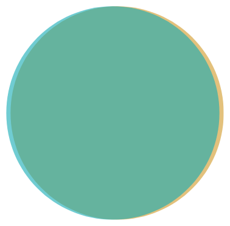

+++
title = "Hiring So Wrong..."
date = 2020-04-20

[taxonomies]
tags = ["work", "hiring"]
+++

Today I found this [article by Neil Sainsbury on hiring
coders](https://www.neilwithdata.com/developer-myth) and how the process is
wrong. While I agree that the whole process is nothing more than red tape, I
don't think the problem is what the article actually says.

<!-- more -->

The point Sainsbury makes is that we lack empathy when hiring. While I may
have got this wrong -- as in "We lack empathy to understand people" instead of
"We lack empathy to give people some chance" -- I believe the problem is that
hiring is done by managers, not coders.

I'm not going to bash managers here -- I worked with pretty damn good managers
but also some awful -- I believe the problem is that managers don't actually
understand what coding actually is. Heck, I don't believe _we_ understand what
coding actually is.

Here, let me show you this with Venn diagrams -- 'cause Venn diagrams are
awesome.

Imagine there is a company hiring developers. They have a set of necessities
they want to fulfil:

And then we have the developer skills:

... which is not what a company actually wants. What they want (or should
want) is actually the size of the developer _phenomenological field_. This
field describes the experiences someone had.

Imagine two developers: Developer A spent the last 5 years working on the same
field (let's say, mobile, or web development), using the same technology (say,
Java, or React); developer B has done a bit of everything: they worked on the
backend in two different languages, played a bit with three different
JavaScript frameworks and did some play with different languages. Both have
the same time in the field, and one could claim that A is a senior developer
'cause they spent so much time in the same field, they probably know
everything about it. But the fact is, when you check their phenomenological
areas, you get something like

What we actually have is that A is an _full_ worker, while B is
actually a _senior_[^1].

But nevermind, 'cause what we actually want is to fulfil the spot with someone
that matches our requirements, right?

Developer B, 'cause we experienced a lot but never got deep into anything,
would have a match like

But developer A actually fits like this

---

[^1]: I once said that what made a difference between full and seniors is the
  amount of crap they had to deal with.
