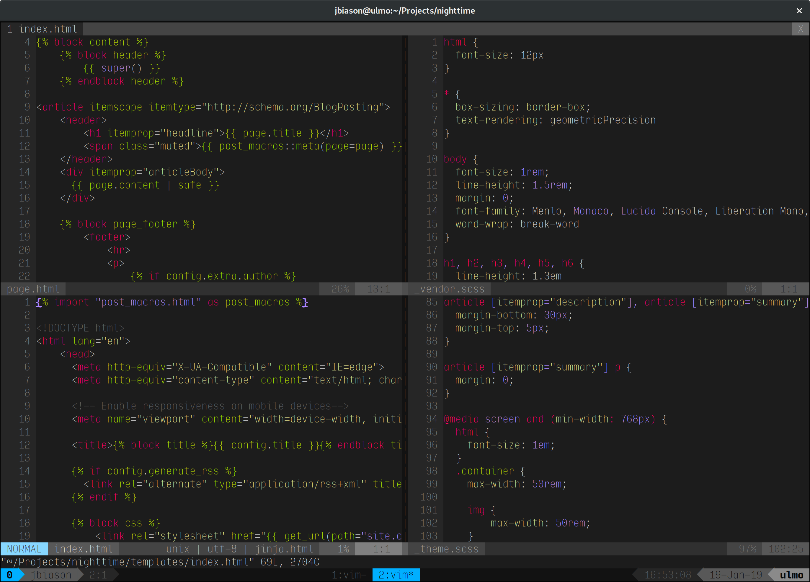
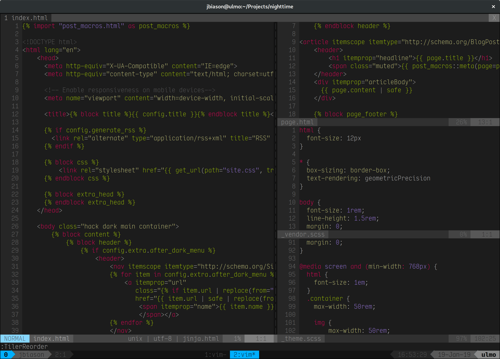

+++
title = "One Week with Tiler"
date = 2019-01-19

[taxonomies]
tags = ["vim", "plugins", "tiler", "tiling"]
+++

Tiler is a tiling split manager for VIM. Here is my experience with it
installed for one week.

<!-- more -->

Recently I had to work with Java (instead of Python) and one thing that happens
when you're working with Java is that you have a bunch of files open at the
same time. Also, I do prefer to keep things in splits 'cause there is always
some information you need to keep visible for reference. But a lot of splits
make visibly finding stuff very *very* hard.

Then suddenly, it hit me: I could use a tiling window manager and it wouldn't
be such a mess; on the other hand, using different windows for each VIM (with
each file) would make copying'n'pasting a hell. So if I could actually find a
tiling *plugin*, that would give me the best of both worlds.

And that's where [Tiler](https://github.com/zhamlin/tiler.vim) gets in.

Tiler is a tiling plugin for VIM. But it doesn't do anything by itself,
meaning, it won't intercept every call to a split to do the tiling. But itadds
new commands to manage the tiling.

For example, to open a new split using the tiling, you need to use
`:TilerOpen`. Again, Tiler won't capture every split, so you can still open
splits with `:split` and `:vsplit`, which would break the tiling arrangements,
so you can put everyhing back in order with `:TilerReorder`.

Tiler has a layout (well, layouts, but they follow the same principle) of one
large split for the main content and small ones for everything else. To bring
one split to the main area, you can use `:TilerFocus`.

And that's basically it.

What I did was to add shortcuts to `:TilerReorder` and `:TilerFocus`. So I
open splits like everyone else



... and then using `<leader><space>` (the configurable leader key followed by
space) to call `:TilerReorder` and I get a nice, tidy workspace:



Although it may look cumbersome, my `leader` is defined to `space`, so to tidy
up everything, all I have to do is press space twice in normal mode.

Also, to help with the "focus on one thing" part, I also put a shortcut to the
`:TilerFocus` command, with `<leader>f`.

And here are my bindings:

```vim
nmap <Leader>f :TilerFocus<CR>
nmap <Leader><space> :TilerReorder<CR>
```

One last thing: The size of the main area is configurable, which is good,
since I found it a bit too large. To adjust it, you can use
`g:tiler#master#size`, which is the size of main split. I found 55% to be a
good size, so I put

```vim
let g:tiler#master#size = 55
```

And that's it. As usual, it takes some time to put the keybinds in "auto mode"
(you know, day-to-day use), but I feel it helps a lot on actually put focus on
some task without the cluttering of splits.
